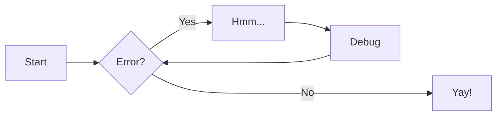

✅ = Obsidian + Website compatible
### Styles ✅ 
- Sidebars - left and right sidebars added
- Dark and light theme - Uses CSS vars for easy modification
- Vertical bars - Added to theme to show expanded navigation, as in default Obsidian
### WikiLinks ✅
This link to the [[Sample]] page was initially just written as `[[Sample]]` in Obsidian and converted by the SamDir plugin during the build process. 
### Mermaid diagrams ✅
Here's the example from [MkDocs Material documentation](https://squidfunk.github.io/mkdocs-material/reference/diagrams/#using-flowcharts): 



### LaTeX Math Support ✅

Inline math looks like $f(x) = x^2$. The input for this is `$f(x) = x^2$`. Use `$...$`.

For a block of math, use `$$...$$` on separate lines

```
$$
F(x) = \int^a_b \frac{1}{2}x^4
$$
```

converts to

$$
F(x) = \int^a_b \frac{1}{2}x^4
$$


### Text Formatting ✅

You can have lists like this

- first
- second
- third

Or checklist lists to

- [ ] ==Get==
- [ ] things
- [ ] ~~done~~

Also, get highlights and strikethroughs as above (similar to Obsidian). More formatting options for your webpage [here](https://squidfunk.github.io/mkdocs-material/reference/formatting/#highlighting-changes). (but not compatible with Obsidian)

### Admonishments ❌
Need to work on these more ... Obsidian has a custom plugin that adds these in this format ... will show up as a code block in MkDocs for now but plugin or JS alteration could likely add styles that mirror Obsidian ... 

```ad-info
This is a sample admonishment from Obsidian using admonishments plugin ... 
```
